# PlasmaDragon - Development TODO List (UPDATED - January 27, 2025)

## 🚀 Project Status - MAJOR MILESTONE ACHIEVED! 🐉

### 🎯 **Latest Achievements (Dragon Model Integration)**
- [x] **DRAGON MODEL IMPORTED** - Unka Toon.FBX successfully integrated!
- [x] **FLIGHT SYSTEMS WORKING** - Dragon flies with mouse + WASD + roll controls
- [x] **TESTING GUI COMPLETE** - Real-time parameter adjustment (F1 key)
- [x] **CAMERA SYSTEM PERFECT** - Smooth following from behind dragon
- [x] **MODULAR SCENE ARCHITECTURE** - Four dedicated scenes for organized development
- [x] **PROJECT PUSHED TO GITHUB** - Full backup and version control

### ✅ **What We've Accomplished (Complete)**
- [x] Backed up previous work to BACKUP_PRE_FRESH_START/
- [x] Created proper Unity project structure with _Project folder
- [x] Set up comprehensive .gitignore for Unity
- [x] Created Packages/manifest.json with essential packages
- [x] Added Unity MCP Bridge package to manifest
- [x] Created assembly definition (PlasmaDragon.Runtime.asmdef)
- [x] Initialized Git repository
- [x] Created initial core scripts (GameManager, InputManager)
- [x] Opened project in Unity 6.0 LTS (latest stable)
- [x] Switched to WebGL platform
- [x] **COMPLETED: Created testFlight_001 scene with flying dragon** ✨
- [x] **COMPLETED: Imported Unka Toon dragon model with Green textures** 🐉
- [x] **COMPLETED: Flight controller with mouse sensitivity GUI** 🎮
- [x] **COMPLETED: Camera follow system working perfectly** 📷
- [x] **COMPLETED: Unity MCP server integration working** 🤖
- [x] Pushed to GitHub: https://github.com/Agentic-Person/PlasmaDragon

## 🗂️ **Current Project File Structure**

### 📊 **Visual Structure (Mermaid Diagram)**

```mermaid
graph TD
    A[🎮 PlasmaDragon Project] --> B[📁 Assets/]
    A --> C[📁 docs/]
    A --> D[📁 tasks/]
    A --> E[📁 Packages/]
    A --> F[📁 ProjectSettings/]
    A --> G[📁 WebBuild/]
    A --> H[📄 README.md]
    A --> I[📄 TODO.md]
    A --> J[📄 PROJECT_STATUS.md]

    B --> K[📁 _Project/ 🚀]
    B --> L[📁 3rdPerson+Fly/]
    B --> M[📁 Toon Adventure Island/]
    B --> N[📁 Editor/]
    B --> O[📁 Plugins/]
    B --> P[📁 StreamingAssets/]

    K --> Q[📁 Scenes/ 🎬]
    K --> R[📁 Scripts/ 💻]
    K --> S[📁 Models/ 🐉]
    K --> T[📁 Materials/]
    K --> U[📁 Prefabs/]
    K --> V[📁 Audio/]
    K --> W[📁 Textures/]
    K --> X[📁 ScriptableObjects/]

    Q --> Q1[📄 testFlight_001.unity ⭐]
    Q --> Q2[📄 MasterOrchestrator_001.unity]
    Q --> Q3[📄 DragonDev_001.unity]
    Q --> Q4[📄 IslandBuildScene_001.unity]

    R --> R1[📁 Player/]
    R --> R2[📁 Combat/]
    R --> R3[📁 Core/]
    R --> R4[📁 AI/]
    R --> R5[📁 UI/]
    R --> R6[📁 Utilities/]
    R --> R7[📄 BasicFlightController.cs ✈️]
    R --> R8[📄 CameraFollow.cs 📷]
    R --> R9[📄 SystemDiagnostic.cs 🔧]
    R --> R10[📄 WorkflowGuide.cs 📋]

    R1 --> R1A[📁 Dragon/]
    R1A --> R1A1[📄 DragonController.cs]
    R1A --> R1A2[📄 DragonAnimator.cs]
    R1A --> R1A3[📄 DragonTransform.cs]
    R1A --> R1A4[📄 DragonInput.cs]

    R3 --> R3A[📁 Managers/]
    R3 --> R3B[📁 Systems/]
    R3B --> R3B1[📄 EventSystem.cs]
    R3B --> R3B2[📄 GameStateManager.cs]
    R3B --> R3B3[📄 InputManager.cs]
    R3B --> R3B4[📄 SceneLoader.cs]

    S --> S1[📁 Dragons/ 🐲]
    S --> S2[📁 Environment/]
    S --> S3[📁 Weapons/]

    S1 --> S1A[📄 Unka Toon.FBX ⭐]
    S1 --> S1B[📁 Textures/]
    S1 --> S1C[📁 Materials/]
    S1B --> S1B1[📄 Green Dragon.png]
    S1B --> S1B2[📄 Yellow Dragon.png]
    S1B --> S1B3[📄 Brown Dragon.png]

    T --> T1[📁 Characters/]
    T --> T2[📁 Effects/]
    T --> T3[📁 Environment/]

    U --> U1[📁 Effects/]
    U --> U2[📁 Enemies/]
    U --> U3[📁 Environment/]
    U --> U4[📁 Player/]
    U --> U5[📁 Weapons/]

    style Q1 fill:#4CAF50,stroke:#2E7D32,color:#fff
    style R7 fill:#2196F3,stroke:#1565C0,color:#fff
    style R8 fill:#2196F3,stroke:#1565C0,color:#fff
    style S1A fill:#FF9800,stroke:#F57C00,color:#fff
    style K fill:#9C27B0,stroke:#6A1B9A,color:#fff
```


### 📁 **Detailed Directory Structure**
```
PlasmaDragon/
├── Assets/
│   ├── _Project/              ← OUR CODE (modular & organized)
│   │   ├── Scenes/           ← 4 DEDICATED SCENES
│   │   │   ├── testFlight_001.unity        ⭐ WORKING DRAGON FLIGHT
│   │   │   ├── MasterOrchestrator_001.unity    (scene management)
│   │   │   ├── DragonDev_001.unity            (dragon development)
│   │   │   └── IslandBuildScene_001.unity     (environment building)
│   │   ├── Scripts/          ← WORKING FLIGHT SYSTEMS
│   │   │   ├── BasicFlightController.cs       ⭐ MOUSE + WASD + ROLL
│   │   │   ├── CameraFollow.cs               ⭐ SMOOTH TRACKING
│   │   │   ├── SystemDiagnostic.cs            (debugging tools)
│   │   │   ├── WorkflowGuide.cs              (development guidelines)
│   │   │   ├── Player/Dragon/                (dragon-specific scripts)
│   │   │   ├── Combat/Weapons & Projectiles/ (future combat)
│   │   │   ├── Core/Managers & Systems/      (game systems)
│   │   │   ├── AI/Boss & Enemies/            (AI behavior)
│   │   │   ├── UI/Menus & HUD/              (user interface)
│   │   │   └── Utilities/                    (helper functions)
│   │   ├── Models/           ← DRAGON ASSETS
│   │   │   └── Dragons/
│   │   │       ├── Unka Toon.FBX            ⭐ MAIN DRAGON MODEL
│   │   │       ├── Textures/                 (Green, Yellow, Brown)
│   │   │       ├── Materials/               (4x3.mat, 07.mat)
│   │   │       └── Animations/              (future animations)
│   │   ├── Materials/        ← ORGANIZED BY TYPE
│   │   │   ├── Characters/   
│   │   │   ├── Environment/  
│   │   │   └── Effects/      
│   │   ├── Prefabs/          ← REUSABLE ASSETS
│   │   ├── Audio/           ← SOUND ORGANIZATION
│   │   ├── Textures/        ← TEXTURE LIBRARY
│   │   └── ScriptableObjects/ ← DATA CONTAINERS
│   ├── 3rdPerson+Fly/        ← REFERENCE FLIGHT SYSTEM
│   ├── Toon Adventure Island/ ← ENVIRONMENT ASSETS
│   ├── Editor/               ← UNITY MCP INTEGRATION
│   ├── Plugins/              ← EXTERNAL LIBRARIES
│   └── StreamingAssets/       ← RUNTIME CONTENT
├── docs/                     ← PROJECT DOCUMENTATION
├── tasks/                    ← DEVELOPMENT ROADMAP
├── Packages/                 ← UNITY PACKAGES
└── ProjectSettings/          ← UNITY CONFIGURATION
```

### 📋 **Immediate Next Steps (Green Dragon Working!)**
1. [x] ~~Open Unity 6.0 LTS~~ ✅ Done
2. [x] ~~Switch to WebGL platform~~ ✅ Done
3. [x] ~~Basic flying cube working~~ ✅ Done
4. [x] ~~**PRIORITY: Import Dragon Model**~~ ✅ **COMPLETED!** 🐉
5. [x] ~~Replace flying cube with dragon model~~ ✅ **COMPLETED!** 
6. [x] ~~Test flight controls with dragon~~ ✅ **WORKING PERFECTLY!** 
7. [ ] **NEXT: Fine-tune dragon materials (Green textures)**
8. [ ] Import environment assets (castle/island from Toon Adventure Island)
9. [ ] Test complete scene workflow (Master → Dragon → Environment)
10. [ ] Add basic combat system (projectiles, targets)

### 🎮 **Current Working Features**
- ✅ **Dragon Flight**: Smooth WASD movement with mouse look
- ✅ **Mouse Controls**: Up/down pitch, side-to-side yaw
- ✅ **Roll Controls**: A/D keys for banking turns
- ✅ **Testing GUI**: F1 key opens real-time parameter adjustment
- ✅ **Camera System**: Follows dragon from behind with smooth interpolation
- ✅ **Physics**: Rigidbody-based flight with configurable drag
- ✅ **Unity MCP**: Server integration for automated development tasks

## 🏗️ **Project Structure (Best Practices - IMPLEMENTED)**
```
✅ CURRENT STRUCTURE:
PlasmaDragon/
├── Assets/
│   ├── _Project/              ← ✅ OUR CODE (underscore keeps at top)
│   │   ├── Scripts/           ← ✅ WORKING FLIGHT SYSTEMS
│   │   ├── Scenes/            ← ✅ 4 MODULAR SCENES 
│   │   ├── Models/Dragons/    ← ✅ DRAGON ASSETS IMPORTED
│   │   ├── Materials/         ← ✅ ORGANIZED BY TYPE
│   │   ├── Prefabs/           ← ✅ READY FOR REUSABLE ASSETS
│   │   ├── Textures/          ← ✅ TEXTURE LIBRARY SETUP
│   │   ├── Audio/             ← ✅ SOUND ORGANIZATION
│   │   └── ScriptableObjects/ ← ✅ DATA CONTAINERS
│   ├── 3rdPerson+Fly/         ← ✅ REFERENCE ASSETS
│   ├── Toon Adventure Island/ ← ✅ ENVIRONMENT ASSETS
│   ├── Editor/                ← ✅ MCP INTEGRATION
│   ├── Plugins/               ← ✅ EXTERNAL LIBRARIES
│   └── StreamingAssets/       ← ✅ RUNTIME CONTENT
```

## 📚 **Lessons Learned & Applied**
1. ✅ **Created folder structure BEFORE importing assets** 
2. ✅ **Switched to WebGL platform immediately after project creation**
3. ✅ **Unity 6.0 LTS is stable and performant**
4. ✅ **Kept custom code in _Project folder, imported assets separate**
5. ✅ **Used assembly definitions for better compilation times**
6. ✅ **Dragon model first approach worked perfectly for visual impact**
7. ✅ **Unity MCP server enables efficient automated development**
8. ✅ **Modular scene architecture supports organized development**

## 🎮 **Development Phases (Updated with Progress)**

### Phase 1: Foundation (Week 1) - 95% COMPLETE ⭐
- [x] Project structure setup
- [x] Git initialization  
- [x] Unity project creation in 6.0 LTS
- [x] WebGL platform configuration
- [x] Unity MCP integration working
- [x] Modular scene architecture (4 scenes created)
- [x] **Dragon model imported and flying!** 🐉
- [x] **Flight controls fully functional**
- [x] **Camera system working perfectly**
- [ ] Fine-tune dragon materials (Green textures) - IN PROGRESS

### Phase 2: Core Gameplay (Week 2) - READY TO START
- [ ] Import castle/island environment assets
- [ ] Basic combat system (dual weapons)
- [ ] Enemy placement and AI
- [ ] Level 1 environment setup
- [ ] Dragon animations (banking, flapping)

### Phase 3: AI Boss System (Week 3)
- [ ] Claude API integration
- [ ] Boss behavior state machine
- [ ] Caching system for API responses
- [ ] Adaptive difficulty system

### Phase 4: Web3 Integration (Week 4)
- [ ] Supabase authentication
- [ ] Solana wallet generation
- [ ] Token reward system
- [ ] n8n automation setup

### Phase 5: Polish & Optimization (Week 5)
- [ ] Visual effects enhancement
- [ ] WebGL-specific optimizations
- [ ] UI/UX improvements
- [ ] Audio integration

### Phase 6: Testing & Deployment (Week 6)
- [ ] Comprehensive testing
- [ ] Performance profiling
- [ ] Landing page creation
- [ ] Final deployment

## 🎯 **Success Metrics (Updated)**
- [x] **Clean, professional code structure maintained** ✅
- [x] **Unity MCP commands working smoothly** ✅
- [x] **Dragon flying with perfect controls** ✅
- [x] **Modular scene architecture implemented** ✅
- [ ] Stable 60 FPS on desktop WebGL
- [ ] AI Boss provides unique encounters each playthrough
- [ ] Web3 onboarding < 60 seconds
- [ ] Build size < 50MB
- [ ] Load time < 20 seconds

## 🛠️ **Technical Stack (Current)**
- **Unity Version**: 6.0 LTS (stable and performant)
- **Render Pipeline**: URP (WebGL optimized)
- **Platform**: WebGL
- **MCP Integration**: justinpbarnett/unity-mcp ✅ WORKING
- **Flight System**: Custom BasicFlightController ✅ WORKING
- **Camera System**: Custom CameraFollow ✅ WORKING
- **Dragon Model**: Unka Toon.FBX ✅ IMPORTED
- **AI**: Claude API for boss behavior (planned)
- **Web3**: Solana Unity SDK (planned)
- **Backend**: Supabase + n8n (planned)

## 📝 **Daily Development Checklist**
- [x] Update TODO.md with progress ✅ CURRENT
- [x] Commit changes with clear messages ✅ REGULAR
- [x] Keep file structure organized ✅ MAINTAINED
- [ ] Test in WebGL build (weekly)
- [ ] Document any issues or learnings

## 🚨 **Critical Reminders (Proven Effective)**
1. ✅ **DO NOT** import assets directly into Assets/ root (structure maintained)
2. ✅ **DO NOT** forget to switch to WebGL platform (already done!)
3. ✅ **DO** use Unity 6.0 LTS (working perfectly)
4. ✅ **DO NOT** mix custom code with imported assets (clean separation)
5. ✅ **ALWAYS** test MCP commands after Unity restarts (working smoothly)

## 📅 **Timeline Status**
- **Start Date**: January 26, 2025
- **Major Milestone**: January 27, 2025 - **DRAGON FLYING!** 🐉
- **Target Completion**: 4-6 weeks
- **Current Week**: 1 
- **Hours Invested**: ~8 hours
- **Progress**: **Phase 1 95% Complete - EXCEEDING EXPECTATIONS!**

---

**🎉 CELEBRATION**: We have a **flying dragon with full controls!** This is a major milestone that validates our entire approach. The modular scene architecture, Unity MCP integration, and clean file structure are all working perfectly together. **Quality achieved while maintaining momentum!** 🚀